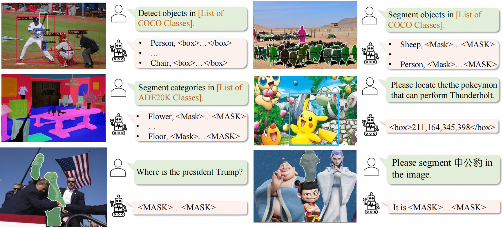
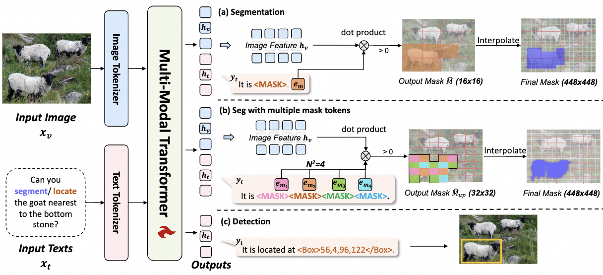
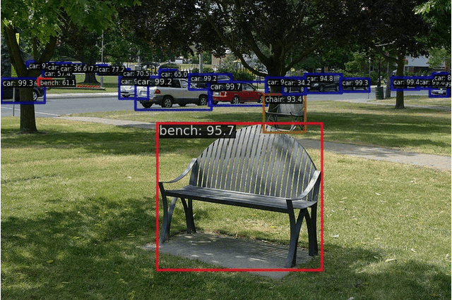

# Unifying Fine-grained Perception into MLLMs w/o Task Decoders. 16 tokens enable precise segmentation
<h5 align="center">

[](https://huggingface.co/papers/2503.01342)
[](http://arxiv.org/abs/2503.01342)
[](https://github.com/nnnth/UFO/blob/main/LICENSE) 
[](https://hits.seeyoufarm.com)
[](https://github.com/nnnth/UFO/issues)
[](https://github.com/nnnth/UFO/issues?q=is%3Aissue%20state%3Aclosed)  <br>
</h5>
<div align="center">
  
</div>

This repo is the official implementation of paper: 🛸 [UFO: A Unified Approach to Fine-grained Visual Perception via Open-ended Language Interface](http://arxiv.org/abs/2503.01342) as well as the follow-ups. We have made every effort to ensure that the codebase is clean, concise, easily readable, state-of-the-art, and relies only on minimal dependencies.

> UFO: A Unified Approach to Fine-grained Visual Perception via Open-ended Language Interface
>
> [Hao Tang](https://scholar.google.com/citations?user=MyarrsEAAAAJ&hl=en), [Chenwei Xie](https://scholar.google.com/citations?hl=en&user=UHCDCRMAAAAJ) , [Haiyang Wang](https://scholar.google.com/citations?user=R3Av3IkAAAAJ&hl=en&oi=ao), [Xiaoyi Bao](https://scholar.google.com/citations?hl=en&user=gSI_eiIAAAAJ), [Tingyu Weng](https://scholar.google.com/citations?user=BN2Ze-QAAAAJ&hl=en&oi=ao), [Pandeng Li](https://lpdone.github.io/), [Yun Zheng](https://scholar.google.com/citations?user=z76PBfYAAAAJ&hl=en)$^\dagger$, [Liwei Wang](https://scholar.google.com/citations?user=VZHxoh8AAAAJ&hl=en) $^\dagger$
> - Primary contact: Hao Tang ( tanghao@stu.pku.edu.cn )

## 📣 News
- [25-9-19] 🔥 UFO is accepted by NeurIPS 2025 as a Spotlight!
- [25-3-12] We release separate [repos](https://huggingface.co/kanashi6/UFO-InternVL2-8B-instruct) of UFO-InternVL2-8B and add [REC inference](https://github.com/nnnth/UFO/blob/main/InternVL/README_UFO.md) on InternVL repo.
- [25-3-4] 🚀 Training and inference Code is released.
- [25-3-3] 👀 UFO is released on [arXiv](http://arxiv.org/abs/2503.01342).

## Overview
- [👀 Todo](https://github.com/nnnth/UFO?tab=readme-ov-file#-todo)
- [🤔 Introduction](https://github.com/nnnth/UFO?tab=readme-ov-file#-introduction)
- [🚀 Main Results](https://github.com/nnnth/UFO?tab=readme-ov-file#-main-results)
- [🛠️ Quick Start](https://github.com/nnnth/UFO?tab=readme-ov-file#%EF%B8%8F-quick-start)
- [👍 Acknowledgments](https://github.com/nnnth/UFO?tab=readme-ov-file#-acknowledgement)
- [📘 Citation](https://github.com/nnnth/UFO?tab=readme-ov-file#-citation)

## 👀 Todo

- [x] Release the [arXiv](http://arxiv.org/abs/2503.01342) version.
- [x] Release code and models of multi-task training on UFO-ViT.
- [x] Release code and models of fine-grained instruction tuning on UFO-InternVL2-8B and UFO-LLaVA-1.5-7B.
- [x] Release full code and models of multi-task training on UFO-InternVL2-8B.

## 🤔 Introduction
Previous efforts to introduce fine-grained perception tasks into MLLMs rely heavily on task-specific decoders or suboptimal formats (e.g., polygons), impeding the visual unified modeling. To overcome this, we propose UFO:
- 😮 **We reformulate segmentation as embedding retrieval**, where the mask token embedding computes similarity with image features by dot product, retrieving high-similarity positions to generate the mask. 

- 🚀 **We first explore the image representation capabilities of MLLMs**. We argue that since MLLMs excel in understanding, the mask information is also in the image features and we just need to retrieve it. 

- 🤗 **Fully aligned with open-ended Language interface**: UFO unifies detection and segmentation through the open-ended language interface **without any additional decoders**, enabling seamless integration with MLLMs.

- 🔥 **Competitive performance**: UFO surpasses GiT, a text-based generalist model, by **12.3** mAP on COCO instance segmentation and **3.3** mIoU on ADE20K. It also matches or exceeds decoder-based methods in various grounding tasks, eliminating the need for task-specific decoders.

<div align="center">
  
</div>

## 🚀 Main Results

### Single-Task Benchmark
|  Model  |Params| Metric | Perfomance |ckpt|config|
|---------|---------|---------|--------|--------|---------|
|  UFO-ViT-B<sub>detection</sub> | 131M|mAP|47.8 | [ckpt](https://huggingface.co/kanashi6/UFO/blob/main/ufo-vit-b-single-det.pth)|[config](https://github.com/nnnth/UFO/blob/main/configs/UFO-ViT/single_detection_base.py)|
|  UFO-ViT-B<sub>insseg</sub> | 131M|mAP|42.6 |[ckpt](https://huggingface.co/kanashi6/UFO/blob/main/ufo-vit-b-single-insseg.pth)|[config](https://github.com/nnnth/UFO/blob/main/configs/UFO-ViT/single_insseg_base.py) |
|  UFO-ViT-B<sub>semseg</sub> | 131M|mIoU|49.5 |[ckpt](https://huggingface.co/kanashi6/UFO/blob/main/ufo-vit-b-single-semseg.pth)|[config](https://github.com/nnnth/UFO/blob/main/configs/UFO-ViT/single_semseg_base.py) |
|  UFO-ViT-B<sub>caption</sub>| 131M|BLEU-4|34.2 | [ckpt](https://huggingface.co/kanashi6/UFO/blob/main/ufo-vit-b-single-caption.pth)| [config](https://github.com/nnnth/UFO/blob/main/configs/UFO-ViT/single_caption_base.py) |
|  UFO-ViT-B<sub>grounding</sub>| 131M|Acc@0.5|83.6 | [ckpt](https://huggingface.co/kanashi6/UFO/blob/main/ufo-vit-b-single-ground.pth)|[config](https://github.com/nnnth/UFO/blob/main/configs/UFO-ViT/single_ground_base.py) |
### Multi-Task Benchmark
|  Model  |Params| Detection | Ins Seg| Sem Seg |Caption |Grounding |ckpt|config|
|---------|---------|---------|--------|--------|---------|---------|---------|---------|
|  UFO-ViT-B<sub>multi-task</sub> | 131M|48.3 | 43.5 | 50.2 |35.3|85.8|[ckpt](https://huggingface.co/kanashi6/UFO/blob/main/ufo-vit-b-multi.pth)| [config](https://github.com/nnnth/UFO/blob/main/configs/UFO-ViT/multi_fivetask_base.py) |
|  UFO-ViT-L<sub>multi-task</sub> | 387M|52.9 | 47.3 | 54.0 |35.9|88.5|[ckpt](https://huggingface.co/kanashi6/UFO/blob/main/ufo-vit-l-multi.pth)|[config](https://github.com/nnnth/UFO/blob/main/configs/UFO-ViT/multi_fivetask_large.py) |
|  UFO-ViT-H<sub>multi-task</sub>| 756M|54.1 | 48.1 | 55.7|37.6|89.2|[ckpt](https://huggingface.co/kanashi6/UFO/blob/main/ufo-vit-h-multi.pth)| [config](https://github.com/nnnth/UFO/blob/main/configs/UFO-ViT/multi_fivetask_huge.py) |


### Task Synergy in Multi-Tasking Training
|  Model  |Params| Detection | Ins Seg| Sem Seg |Caption |Grounding |
|---------|---------|---------|--------|--------|---------|---------|
|  UFO-B<sub>single-task</sub> | 131M|47.8 | 42.6| 49.5 |34.2|83.6|
|  *Improvement* | |*+0.5* | *+0.9*| *+0.7* |*+1.1*|*+2.2*|
|  UFO-B<sub>multi-task</sub> | 131M|48.3 | 43.5 | 50.2 |35.3|85.8|

### MLLM Performance on Multi-Task Benchmark 
UFO-InternVL2-8B: 
|  Resolution | Detection | Ins Seg| Sem Seg |Caption |Grounding |ckpt|config|
|---------|---------|---------|--------|--------|---------|---------|---------|
|  448x448| 44.0 | 37.4|53.9 |39.6 |90.4|[ckpt](https://huggingface.co/kanashi6/UFO/tree/main/ufo-internvl2-8b-multi-448)|[config](https://github.com/nnnth/UFO/blob/main/configs/UFO-InternVL2-8B-multitask/multi_448_30w.py) |
|  896x896|50.9 | 43.6 | 54.6|-|-|[ckpt](https://huggingface.co/kanashi6/UFO/tree/main/ufo-internvl2-8b-multi-896)|[config](https://github.com/nnnth/UFO/blob/main/configs/UFO-InternVL2-8B-multitask/multi_896_6w.py) |
|  1344x1344|51.9 | 45.2 | -|-|-|[ckpt](https://huggingface.co/kanashi6/UFO/tree/main/ufo-internvl2-8b-multi-1344)|[config](https://github.com/nnnth/UFO/blob/main/configs/UFO-InternVL2-8B-multitask/multi_1344_4w.py) |

### Visual Grounding
RefCOCO Validation Set
|  Model  |  REC | RES |ckpt|config|
|---------|---------|---------|--------|--------|
|  UFO-LLaVA-1.5-7B |89.9|76.2|[ckpt](https://huggingface.co/kanashi6/UFO/blob/main/ufo-llava-1.5-7b-instruction.pth)| [config](https://github.com/nnnth/UFO/blob/main/configs/UFO-LLaVA1.5-7B/llava1.5_7b_instruction_12w.py) |
|  UFO-LLaVA-1.5-7B (ft) |  90.8 | 77.2|[ckpt](https://huggingface.co/kanashi6/UFO/blob/main/ufo-llava-1.5-7b-rec.pth)| [config](https://github.com/nnnth/UFO/blob/main/configs/UFO-LLaVA1.5-7B/llava1.5_7b_rec_ft_2w.py) |
|  UFO-InternVL2-8B  | 90.7 | 77.3|[ckpt](https://huggingface.co/kanashi6/UFO/blob/main/ufo-internvl2-8b-instruction.pth)| [config](https://github.com/nnnth/UFO/blob/main/configs/UFO-InternVL2-8B/internvl2_8b_instruction_12w.py) |
|  UFO-InternVL2-8B (ft)  |91.4|78.0|[ckpt](https://huggingface.co/kanashi6/UFO/blob/main/ufo-internvl2-8b-rec.pth)| [config](https://github.com/nnnth/UFO/blob/main/configs/UFO-InternVL2-8B/internvl2_8b_rec_ft_2w.py) |
### Reasoning Segmentation

|  Model  | Overall | Short Query | Long Query | ckpt | config|
|---------|---------|---------|--------|--------|---------|
|  UFO-LLaVA-1.5-7B |53.8|40.1| 58.2| [ckpt](https://huggingface.co/kanashi6/UFO/blob/main/ufo-llava-1.5-7b-instruction.pth)| [config](https://github.com/nnnth/UFO/blob/main/configs/UFO-LLaVA1.5-7B/llava1.5_7b_instruction_12w.py) |
|  UFO-LLaVA-1.5-7B (ft) |  58.0 | 46.3|61.7 | [ckpt](https://huggingface.co/kanashi6/UFO/blob/main/ufo-llava-1.5-7b-reasonseg.pth)| [config](https://github.com/nnnth/UFO/blob/main/configs/UFO-LLaVA1.5-7B/llava1.5_7b_reasonseg_ft_1w.py) |
|  UFO-InternVL2-8B  | 55.4 | 41.9| 59.8| [ckpt](https://huggingface.co/kanashi6/UFO/blob/main/ufo-internvl2-8b-instruction.pth)| [config](https://github.com/nnnth/UFO/blob/main/configs/UFO-InternVL2-8B/internvl2_8b_instruction_12w.py) |
|  UFO-InternVL2-8B (ft)  |61.2|49.6| 64.9| [ckpt](https://huggingface.co/kanashi6/UFO/blob/main/ufo-internvl2-8b-reasonseg.pth)| [config](https://github.com/nnnth/UFO/blob/main/configs/UFO-InternVL2-8B/internvl2_8b_reasonseg_ft_1w.py) |

## 🛠️ Quick Start
### Installation

```shell
conda create -n UFO python=3.11

conda activate UFO

pip install torch==2.1.0+cu118 torchvision==0.16.0+cu118 -f https://download.pytorch.org/whl/torch_stable.html
pip install -U openmim
mim install "mmengine==0.8.3"
mim install "mmcv==2.1.0"
pip install "transformers==4.37.2"

git clone git@github.com:nnnth/UFO.git
cd UFO

pip install -v -e .
pip install -r requirements/optional.txt
pip install -r requirements/runtime.txt
```
- (Optional) Install Java manually for image caption evaluation. Without Java, you can train image caption normally, but fail in caption evaluation.

### Dataset Preparation
#### Multi-Tasking Dataset
We follow GiT to prepare the multi-task datasets. Please refer [here](https://github.com/Haiyang-W/GiT#multi-tasking-dataset) for more details.

#### Instruction Tuning Dataset
We use 24 datasets in for instruction tuning on MLLMs. For more details, please refer [here](https://github.com/nnnth/UFO/blob/main/tools/dataset_preprocess/dataset_prepare.md).

### Download Pretraining Weight
We use [LLaVA-1.5-7B](https://huggingface.co/llava-hf/llava-1.5-7b-hf) and [InternVL2-8B](https://huggingface.co/OpenGVLab/InternVL2-8B) as MLLM pretraining. In multi-task training on UFO-ViT, we also use [Bert Tokenizer](https://huggingface.co/google-bert/bert-base-uncased) and [Bert Embeddings](https://huggingface.co/kanashi6/UFO/tree/main). Please download and organize them as follows:
```
UFO
|──ckpt
|──|──llava-1.5-7b-hf
|──|──InternVL2-8B
|──|──bert-base-uncased
|──|──bert_embed_womask.pt
|──|──bert_embed.pt
|──|──bert_embed_large.pt
|──|──bert_embed_huge.pt
```
For InternVL2-8B, we add a custom function for lora training. Please replace the original file following [issue](https://github.com/nnnth/UFO/issues/6).

### Demo
Please download checkpoints from [kanashi6/UFO](https://huggingface.co/kanashi6/UFO), then save them under root dir:
```
UFO
|──ufo-vit-b-single-det.pth
|──ufo-vit-b-single-insseg.pth
|──...
```

Run demo on detection (coco):
```shell
python demo.py --img_path demo/demo.jpg --config configs/UFO-ViT/single_detection_base.py \
  --ckpt_path ./ufo-vit-b-single-det.pth --out_dir ./vis/ --task detection
```

Run demo on RES:
```shell
python demo.py --img_path demo/demo.jpg --config configs/UFO-InternVL2-8B/internvl2_8b_res_ft_2w.py \
  --ckpt_path ./ufo-internvl2-8b-res.pth --out_dir ./vis/ --task res --text bench

```

<div align="center">
  
</div>

### Scripts
For Training and evaluation commands, please refer [here](https://github.com/nnnth/UFO/blob/main/docs/en/UFO_commands.md).

## 👍 Acknowledgement
* [MMDetection](https://github.com/open-mmlab/mmdetection) The codebase we built upon. Thanks for providing such a convenient framework.
* [GiT](https://github.com/Haiyang-W/GiT) We use the multi-task benchmark established by GiT.
* [InternVL](https://github.com/OpenGVLab/InternVL) We borrow codes of MLLMs from InternVL repo.

## 📘 Citation
Please consider citing our work as follows if it is helpful.
```
@article{tang2025ufo,
    title={UFO: A Unified Approach to Fine-grained Visual Perception via Open-ended Language Interface},
    author={ Hao Tang, Chenwei Xie, Haiyang Wang, Xiaoyi Bao, Tingyu Weng, Pandeng Li, Yun Zheng, Liwei Wang},
    journal={arXiV:2503.01342},
    year={2025}
}
```

## ✨ Star History
[](https://star-history.com/#nnnth/UFO&Date)


